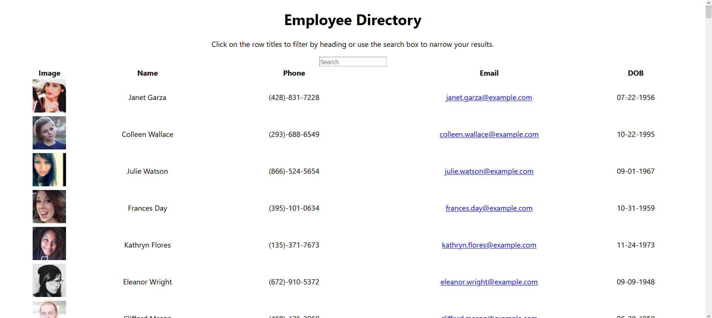
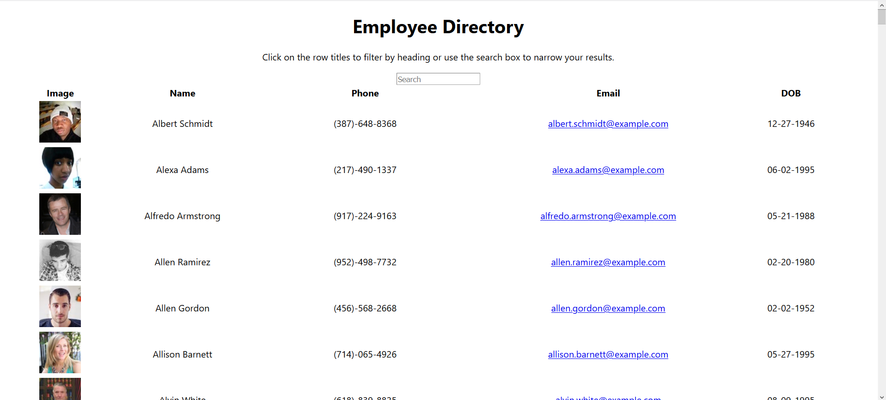

* Employee Directory

<!-- Live link to deployed app -->
Repository: https://github.com/Mdudzik92/employeedirectory  
Deployed app: https://mdudzik92.github.io/employeedirectory/

<!-- Technologies used -->
ReactJS, JavaScript, JSX, Node.js, JSON

<!-- Explanation of what the app is -->
This is an app which allows the user to view and filter a list of employees by first and last name for optimal instantaneous rendering. The user will need to see the deployed app link listed above to view the Employee Directory. If the user clicks the row header "Name" it will reorganize the list alphabetically.

<!-- Screenshot -->
  

<!-- License -->
MIT

<!-- Contact information -->
Email: mdudzik92@gmail.com