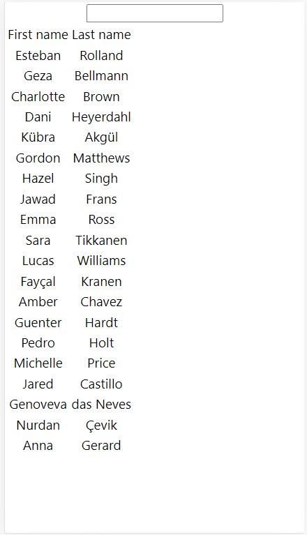
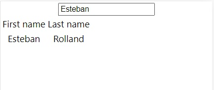

* Employee Directory

<!-- Live link to deployed app -->
Repository: https://github.com/Mdudzik92/employeedirectory
Deployed app: https://mdudzik92.github.io/employeedirectory/

<!-- Technologies used -->
React, JavaScript, JSX, Node.js, JSON

<!-- Explanation of what the app is -->
This is an app which allows the user to view and filter a list of employees by first and last name for optimal instantaneous rendering. The user will be required to git pull from this repository, then run npx create-react-app in their terminal after navigating to their employeedirectory folder on their local machine in order to view the list. 

<!-- Screenshot -->

<!-- License -->
MIT

<!-- Contact information -->
Email: mdudzik92@gmail.com